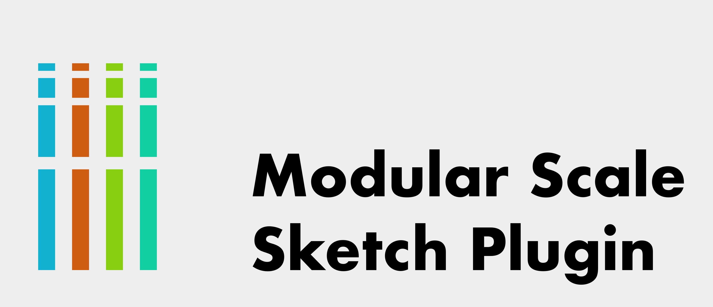

# Modular Scale Sketch Plugin

## What it does.
A small plugin for moving and scaling layers along a modular scale.

## Why it's useful
This plugin will move the selected layers along the modular scale by a specified step, or resize
them proportionally to a specified step. This makes the whole process of working with modular
scales a lot more intuitive, and removes the need to shift focus.

## What is a modular scale?
The modular scale is a tool that's been used by graphic designers and typographers
for decades for creating harmonious layouts. See [modularscale.com](http://modularscale.com) 
for examples.

## TODO
- [ ] Add gif to readme.
- [ ] Make the exponent field a pre-populated dropdown.
- [ ] Add option to scale dialogs for turning off proportional scaling.

## Bugs 🐞
Please submit bugs under the issues tab so that they can be tracked and fixed.
